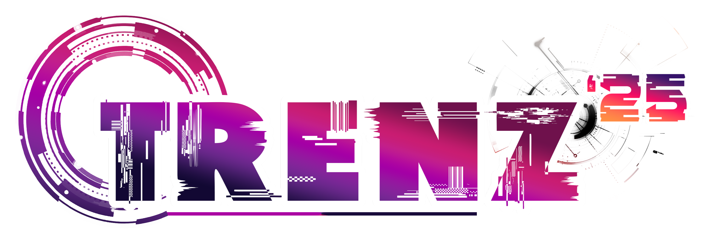

# Trenz'26 - Intercollegiate Skill Fest



## 📋 Table of Contents
- [Overview](#overview)
- [Features](#features)
- [Project Structure](#project-structure)
- [Technology Stack](#technology-stack)
- [Events](#events)
- [Installation](#installation)
- [Configuration](#configuration)
- [Usage](#usage)
- [Admin Panel](#admin-panel)
- [Code Rewind Module](#code-rewind-module)
- [Database Schema](#database-schema)
- [Email Configuration](#email-configuration)
- [Contributing](#contributing)
- [Contact](#contact)

## 🎯 Overview

**Trenz'26** is a comprehensive web-based event management system for an Intercollegiate Skill Fest. The platform facilitates student registration, event management, payment verification, and participant tracking for various technical and non-technical competitions held at MKCE Karur.

The symposium brings together thought leaders, researchers, and industry professionals to explore cutting-edge innovations and emerging trends across multiple disciplines including:
- Web Development
- App Development
- Coding Competitions
- Debugging Challenges
- Startup Ideation
- Resume Building

**Event Date:** April 30, 2026  
**Venue:** MKCE Karur  
**Contact:** trenz2k26@gmail.com | +91 6385650033

## ✨ Features

### For Participants
- **User Registration System** - Comprehensive registration with college details
- **Event Selection** - Choose from 7 different technical and non-technical events
- **Payment Integration** - Upload transaction receipts and ID cards
- **Email Confirmation** - Automatic email with Trenz ID upon successful registration
- **Event Information** - Detailed pages for each event with rules and guidelines
- **Responsive Design** - Mobile-friendly interface with particle effects

### For Administrators
- **Admin Dashboard** - Comprehensive event and participant management
- **Registration Approval** - Review and approve participant registrations
- **Payment Verification** - View and verify payment screenshots
- **Participant Management** - Track all registered participants and their events
- **Multi-level Admin Access** - Super admin and event admin roles
- **Spot Registration** - On-site registration capability
- **Export Functionality** - Download participant data

### Special Module: Code Rewind
- **Real-time Coding Competition** - Flask-based live coding platform
- **Auction System** - Interactive bidding mechanism using WebSocket
- **Points Management** - HackerRank points, detected points, fairness points
- **Live Leaderboard** - Real-time ranking updates
- **Admin Controls** - CSV upload for bulk point updates
- **Team Registration** - Support for team-based participation

## 📁 Project Structure

```
Trenz/
│
├── Trenz26/                          # Main event website (2026)
│   ├── index.html                    # Landing page
│   ├── register.php                  # Participant registration
│   ├── admin.php                     # Admin login
│   ├── adminDashboard.php            # Admin dashboard
│   ├── backend.php                   # Backend logic & email
│   ├── db.php                        # Database connection
│   ├── events.php                    # Event management
│   ├── participants.php              # Participant listing
│   ├── spotRegistration.php          # On-spot registration
│   ├── logout.php                    # Session management
│   │
│   ├── Event Pages/
│   │   ├── web.html                  # Web Weave event
│   │   ├── startup.html              # NextGen Start event
│   │   ├── app.html                  # App A thon event
│   │   ├── debugging.html            # Error 404 event
│   │   ├── coderewind.html           # Code Rewind event
│   │   ├── codequest.html            # Code Quest event
│   │   └── resumebuilding.html       # Resume Building event
│   │
│   ├── Styles/
│   │   ├── styles.css                # Main stylesheet
│   │   ├── login.css                 # Login page styles
│   │   ├── admin.css                 # Admin panel styles
│   │   └── assistant.css             # Assistant/helper styles
│   │
│   ├── Scripts/
│   │   ├── script.js                 # Main JavaScript
│   │   └── assistant.js              # Assistant functionality
│   │
│   ├── assets/
│   │   ├── images/                   # Event images & logos
│   │   ├── idcard/                   # Uploaded ID cards
│   │   └── payment/                  # Payment receipts
│   │
│   ├── codeRewind/                   # Flask coding competition module
│   │   ├── app.py                    # Flask application
│   │   ├── models.py                 # Database models
│   │   ├── instance/                 # SQLite database
│   │   ├── migrations/               # Database migrations
│   │   ├── static/                   # CSS, JS, images
│   │   └── templates/                # HTML templates
│   │
│   ├── Admin/                        # Super admin panel
│   │   ├── index.php                 # Admin login
│   │   ├── superDashboard.php        # Super admin dashboard
│   │   ├── superEvents.php           # Event management
│   │   ├── manageAdmin.php           # Admin user management
│   │   └── participants.php          # All participants view
│   │
│   ├── PHPMailer/                    # Email library
│   │   ├── src/                      # PHPMailer source
│   │   └── language/                 # Email templates
│   │
│   └── MKCE/                         # MKCE specific version
│
├── Trenz27/                          # Next year's template (2027)
│   └── [Similar structure as Trenz26]
│
└── Schema/
    └── trenz.sql                     # Database schema

```

## 🛠️ Technology Stack

### Frontend
- **HTML5** - Semantic markup
- **CSS3** - Modern styling with animations
- **JavaScript** - Interactive functionality
- **Particles.js** - Background particle effects
- **Remix Icons** - Icon library
- **Google Fonts** - Poppins font family
- **SweetAlert2** - Beautiful alert dialogs

### Backend
- **PHP** - Server-side scripting
- **MySQL** - Database management
- **PHPMailer** - Email sending functionality
- **Python Flask** - Code Rewind module
- **Flask-SocketIO** - Real-time communication
- **SQLAlchemy** - ORM for Flask

### Libraries & Frameworks
- **Flask-Migrate** - Database migrations
- **Werkzeug** - Password hashing
- **Pandas** - CSV data processing
- **Eventlet** - Async WebSocket support

## 🎪 Events

### 1. Web Weave
**Category:** Technical  
**Description:** Showcase web development skills by creating responsive and innovative website designs.

### 2. NextGen Start
**Category:** Non-Technical  
**Description:** Present innovative startup ideas and business models to a panel of industry experts.

### 3. App A thon
**Category:** Technical  
**Description:** Design and develop mobile applications that solve real-world problems using cutting-edge technologies.

### 4. Error: 404 NOT FOUND
**Category:** Technical  
**Description:** Test debugging skills by finding and fixing errors in complex code snippets under time pressure.

### 5. Code Rewind
**Category:** Technical  
**Description:** Flagship coding competition featuring challenging algorithmic problems and real-world scenarios with live bidding system.

### 6. Code Quest
**Category:** Non-Technical  
**Description:** Treasure hunt style coding challenge with puzzles and problem-solving tasks.

### 7. Build a Resume
**Category:** Non-Technical  
**Description:** Professional resume building workshop and competition.

## 🚀 Installation

### Prerequisites
- **XAMPP/WAMP/LAMP** - Apache, MySQL, PHP
- **Python 3.8+** - For Code Rewind module
- **pip** - Python package manager
- **Modern Web Browser** - Chrome, Firefox, Edge

### Step 1: Clone the Repository
```bash
git clone https://github.com/jayanthansenthilkumar/Trenz.git
cd Trenz
```

### Step 2: Database Setup
1. Start Apache and MySQL from XAMPP/WAMP control panel
2. Open phpMyAdmin (http://localhost/phpmyadmin)
3. Create a new database named `trenz`
4. Import the schema:
   ```sql
   -- Navigate to Schema/trenz.sql and import
   ```

### Step 3: PHP Configuration
1. Move the project to your web server directory:
   - XAMPP: `C:\xampp\htdocs\Trenz`
   - WAMP: `C:\wamp64\www\Trenz`
   - LAMP: `/var/www/html/Trenz`

2. Update database connection in `db.php`:
   ```php
   $conn = new mysqli("localhost", "root", "", "trenz");
   ```

### Step 4: Code Rewind Setup (Flask Module)
```bash
# Navigate to Code Rewind directory
cd Trenz25/codeRewind

# Create virtual environment
python -m venv venv

# Activate virtual environment
# Windows:
venv\Scripts\activate
# Linux/Mac:
source venv/bin/activate

# Install dependencies
pip install flask flask-socketio flask-sqlalchemy flask-migrate pandas werkzeug eventlet

# Initialize database
flask db init
flask db migrate -m "Initial migration"
flask db upgrade

# Run the application
python app.py
```

The Flask app will run on `http://localhost:5000`

### Step 5: Email Configuration
Update PHPMailer settings in `backend.php`:
```php
$mail->Username   = 'your-email@gmail.com';
$mail->Password   = 'your-app-password';  // Use App Password, not regular password
```

## ⚙️ Configuration

### Database Configuration (db.php)
```php
<?php
$conn = new mysqli("localhost", "root", "", "trenz");
if($conn->connect_error){
    die("Connection failed: " . $conn->connect_error);
}
?>
```

### Flask Configuration (app.py)
```python
app.secret_key = 'your_secret_key_here'
app.config['SQLALCHEMY_DATABASE_URI'] = 'sqlite:///database.db'
app.config['SECRET_KEY'] = 'your_socket_secret_key'
```

### Email SMTP Settings
- **Host:** smtp.gmail.com
- **Port:** 587
- **Encryption:** STARTTLS
- **Authentication:** Required

**Note:** For Gmail, enable "Less secure app access" or use an App Password.

## 📖 Usage

### For Participants

1. **Visit Website**
   - Navigate to `http://localhost/Trenz/Trenz26/`

2. **Browse Events**
   - Explore event details from the Events section

3. **Register**
   - Click on specific event or "Get Started"
   - Fill registration form with:
     - Name, Email, Registration Number
     - Department, College Name, Phone
     - Event selection
     - Upload ID card (College ID)
     - Upload payment screenshot
     - Transaction details

4. **Confirmation**
   - Receive auto-generated Trenz ID
   - Email confirmation sent to registered email

5. **Code Rewind Participation**
   - Register at `http://localhost:5000/register`
   - Login to dashboard
   - Participate in live coding challenges
   - View leaderboard rankings

### For Event Admins

1. **Login**
   - Navigate to `admin.php`
   - Enter credentials (Event Admin role)

2. **Dashboard Access**
   - View pending registrations
   - Approve/reject participants
   - Verify payment screenshots and ID cards
   - View participant details

3. **Spot Registration**
   - Use spot registration for walk-in participants
   - Direct approval without payment verification

### For Super Admins

1. **Login**
   - Access `Admin/index.php`
   - Super admin credentials required

2. **Complete Control**
   - Manage all events
   - Manage admin users
   - View comprehensive participant lists
   - Export data for analysis
   - Access all event statistics

## 👨‍💼 Admin Panel

### Admin Roles

#### Event Admin (Role = 0)
- View event-specific participants
- Approve/reject registrations
- Verify documents
- On-spot registration

#### Super Admin (Role = 1)
- All Event Admin permissions
- Create/manage admin users
- Cross-event participant viewing
- System-wide analytics
- Database management

### Default Admin Login
**Code Rewind Module:**
- Username: `code_rewind_admin`
- Password: `code_rewind_admin`
- Email: `admin@gmail.com`

### Admin Features
- **Participant Approval Workflow**
- **Document Verification System**
- **Payment Status Tracking**
- **Email Notification System**
- **Export to CSV/Excel**
- **Real-time Registration Count**

## 🏆 Code Rewind Module

### Features
- **User Registration & Authentication**
- **Team Member Management**
- **Real-time Bidding System**
- **Multi-dimensional Point System:**
  - HackerRank Points
  - Detected Points (from bidding)
  - Fairness Points (regenerating over time)
- **Live Leaderboard**
- **Admin CSV Upload** for bulk point updates
- **WebSocket Integration** for real-time updates

### Admin Functions
- Upload CSV with email and HackerRank points
- Update fairness points (auto-regenerating to 1000)
- Delete users
- View real-time auction status
- Control auction opening/closing

### Running Code Rewind
```bash
cd Trenz26/codeRewind
python app.py
# Access at http://localhost:5000
```

### WebSocket Events
- `new_bid` - User places a bid
- `bid_update` - Broadcast new highest bid
- `auction_bid` - Update auction item
- `linkUpdate` - Update challenge links

## 🗄️ Database Schema

### Main Tables

#### `events` Table
- `id` - Primary key (Auto increment)
- `Trenzid` - Unique participant ID (TRENZ26XXXX)
- `name` - Participant name
- `emailid` - Email address
- `regno` - College registration number
- `depart` - Department
- `collegename` - College name
- `phoneno` - Contact number
- `events1` - Selected event
- `idcard` - ID card filename
- `date` - Transaction date
- `transactionid` - Payment transaction ID
- `transactionreceipt` - Receipt filename
- `status` - Approval status (0=Pending, 1=Approved, 2=Spot Registration)

#### `login` Table
- `userid` - Admin username
- `password` - Admin password
- `role` - Access level (0=Event Admin, 1=Super Admin)

#### `user` Table (Flask - Code Rewind)
- `id` - Primary key
- `email` - User email
- `username` - Unique username
- `password` - Hashed password
- `team_members` - Team member names
- `hacker_rank_points` - HackerRank score
- `detected_points` - Points from bidding
- `fairness_points` - Time-based regenerating points
- `last_updated_time` - Last fairness update
- `is_admin` - Admin flag
- `isOpen` - Auction participation status

## 📧 Email Configuration

### Gmail SMTP Setup

1. **Enable 2-Factor Authentication** on your Gmail account

2. **Generate App Password:**
   - Go to Google Account Settings
   - Security → 2-Step Verification
   - App Passwords → Generate new password
   - Select "Mail" and "Other" (custom name)

3. **Update backend.php:**
```php
$mail->Username   = 'trenz2k25@gmail.com';
$mail->Password   = 'ikoximjgvynasved'; // Your App Password
```

### Email Template
Auto-generated emails include:
- Participant Name
- Trenz ID
- Registered Event(s)
- Confirmation message

## 🎨 Customization

### Changing Colors
Edit `styles.css`:
```css
:root {
    --primary-color: #4361ee;
    --secondary-color: #3a0ca3;
    --accent-color: #f72585;
}
```

### Adding New Events
1. Create event HTML page (e.g., `newevent.html`)
2. Add event card in `index.html` Events section
3. Update registration form event dropdown
4. Add event-specific styling

### Modifying Organizers
Edit patron cards section in `index.html`:
```html
<div class="patron-card">
    <div class="patron-image">
        
    </div>
    <div class="patron-details">
        <h3>Name</h3>
        <p class="patron-title">Organizer</p>
        <div class="patron-contact">
            <a href="tel:+91XXXXXXXXXX" class="contact-link phone">
                <i class="ri-phone-line"></i> Call
            </a>
            <a href="https://wa.me/91XXXXXXXXXX" class="contact-link whatsapp">
                <i class="ri-whatsapp-line"></i> WhatsApp
            </a>
        </div>
    </div>
</div>
```

## 🤝 Contributing

Contributions are welcome! Please follow these steps:

1. Fork the repository
2. Create a feature branch (`git checkout -b feature/AmazingFeature`)
3. Commit your changes (`git commit -m 'Add some AmazingFeature'`)
4. Push to the branch (`git push origin feature/AmazingFeature`)
5. Open a Pull Request

### Development Guidelines
- Follow existing code style
- Comment complex logic
- Test thoroughly before committing
- Update documentation for new features

## 📞 Contact

### Event Organizers

**Abbishek Krishna T K**  
📞 +91 6385650033  
💬 [WhatsApp](https://wa.me/916385650033)

**Deepak Rajan K**  
📞 +91 9791852116  
💬 [WhatsApp](https://wa.me/919487274363)

**Manikandan Prabhu C**  
📞 +91 7540006268  
💬 [WhatsApp](https://wa.me/917540006268)

**Srivarth G P**  
📞 +91 8438796113  
💬 [WhatsApp](https://wa.me/918438796113)

### Official Contact
📧 **Email:** trenz2k26@gmail.com  
📍 **Location:** MKCE Karur  
🌐 **Website:** http://localhost/Trenz/Trenz26/

## 🏢 Sponsors

### Principal Sponsor
- **Trivasiya**

### Gold Sponsors
- **6sport**
- **Trimp**

## 📄 License

This project is developed for **Trenz'26** - An Intercollegiate Skill Fest at MKCE Karur.

## 🙏 Acknowledgments

- MKCE Karur for hosting the event
- All organizing committee members
- Sponsors for their support
- Participants for their enthusiasm
- Open-source libraries and frameworks used

## 📋 Event Information

**Event Name:** Trenz'26 - An Intercollegiate Skill Fest  
**Date:** April 30, 2026  
**Time:** 9:00 AM - 6:00 PM  
**Venue:** MKCE Karur  
**Registration:** Open  

---

**Built with ❤️ by Trenz'26 Team**

*Connecting Minds, Creating Future*
